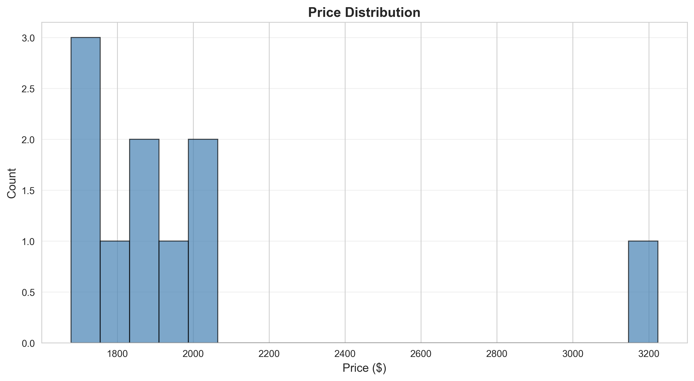
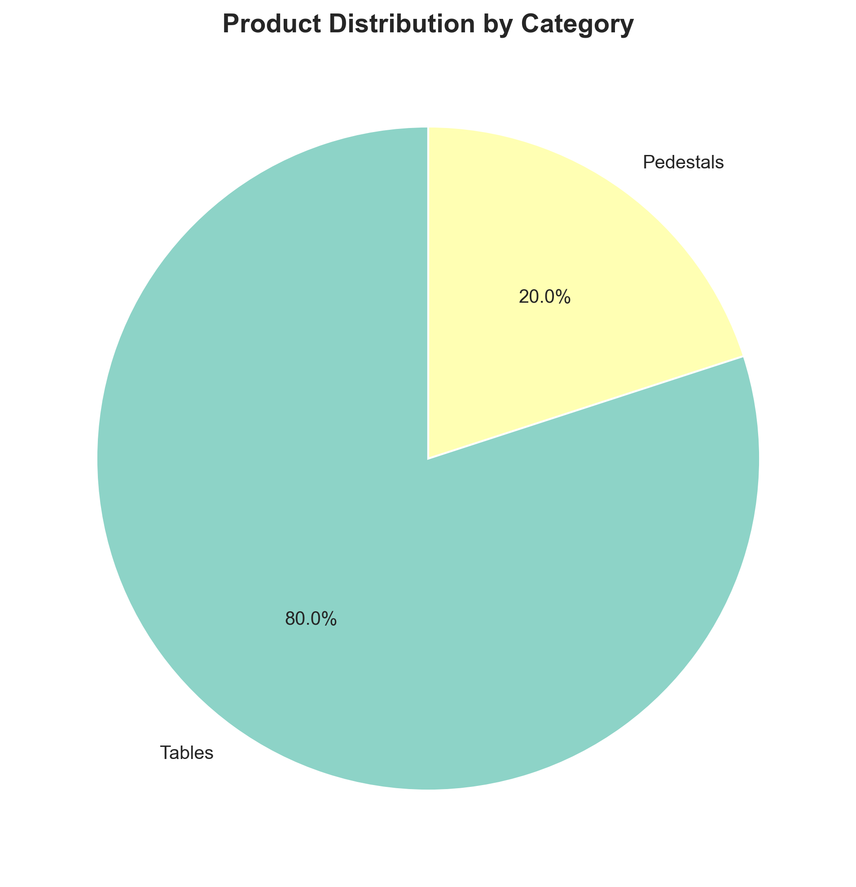

# Competitive Intelligence Report

**Generated:** 2025-10-03 20:32:07  
**Products Analyzed:** 10  
**Catalogs Processed:** 2

---

## Executive Summary

This report provides a comprehensive competitive intelligence analysis of products from multiple manufacturer catalogs. The analysis includes pricing strategies, feature comparisons, market positioning, and actionable recommendations.

### Key Findings

- **Total Products Analyzed:** 10
- **Price Range:** $1677.96 - $3224.00
- **Average Price:** $1983.32
- **Median Price:** $1845.34
- **Categories:** Tables, Pedestals

---

## 1. Pricing Analysis

# Product Pricing Data Analysis

## 1. Statistical Summary (Overall)
**Price Data (all products, $):**  
1677.96, 1716.46, 1706.45, 1811.84, 1850.34, 1840.33, 1960.68, 1989.17, 2056.00, 3224.00

- **Count:** 10 products
- **Min Price:** $1,677.96
- **Max Price:** $3,224.00
- **Range:** $1,546.04
- **Average Price:** $1,983.52
- **Median Price:** $1,850.34
- **Standard Deviation:** $409.77

---

## 2. Pricing Distribution by Category

### **Category: Tables**
- **Products:** 8 (all Haworth brand)
- **Prices ($):** 1677.96, 1716.46, 1706.45, 1811.84, 1850.34, 1840.33, 1960.68, 1989.17
- **Min:** $1,677.96
- **Max:** $1,989.17
- **Average:** $1,818.15
- **Median:** $1,826.09
- **Std Dev:** $119.77

### **Category: Pedestals**
- **Products:** 2 (all Knoll brand)
- **Prices ($):** 2,056.00, 3,224.00
- **Min:** $2,056.00
- **Max:** $3,224.00
- **Average:** $2,640.00
- **Median:** $2,640.00
- **Std Dev:** $829.00 (notable due to only 2 data points)

---

## 3. Pricing Tier Breakdown

- **Budget (< $1,800):**
  - Tables: 1677.96, 1716.46, 1706.45
- **Mid-Range ($1,800–$2,200):**
  - Tables: 1811.84, 1850.34, 1840.33, 1960.68, 1989.17
  - Pedestals: 2,056.00
- **Premium (>$2,200):**
  - Pedestals: 3,224.00

**Summary:**  
- All tables are budget or mid-range.
- Pedestals are mid-range to premium.

---

## 4. Manufacturer/Brand Comparison

### **Haworth (Tables)**
- **Price Range:** $1,677.96 to $1,989.17
- **Average:** $1,818.15
- **Median:** $1,826.09
- **Std Dev:** $119.77

### **Knoll (Pedestals)**
- **Price Range:** $2,056.00 to $3,224.00
- **Average:** $2,640.00
- **Median:** $2,640.00
- **Std Dev:** $829.00

**Key Insight:**  
Knoll's pedestal products are priced significantly higher than Haworth's tables, occupying the upper mid-range and premium tiers.

---

## 5. Price-Feature Correlation

### **Tables**
- All have very similar features (symmetrical base, wood/HPL finish, power/no power, fixed height).
- **Price increases with size** (e.g., 48"x48" starts at $1,677.96; 60"x60" reaches $1,989.17).
- **Power ready** adds $20–$30 over similar non-powered models.
  - Example: 48"x48" no power ($1,677.96) vs. power ready ($1,706.45) = +$28.49.
- Features have a weak price correlation; main impact comes from dimensions, not feature count.

### **Pedestals**
- Both have similar features (configuration and wood interiors).
- **Price increases with number of box compartments** (box/file: $2,056 vs. box/box/box: $3,224).
- Stronger correlation between configuration complexity and price.

**Overall:**  
- **Tables:** Price driven by size, not feature count.  
- **Pedestals:** Price more sensitive to configuration/features.

---

## 6. Outlier Identification

- **Lowest Price:** $1,677.96 (Haworth 48"x48" table, no power)
- **Highest Price:** $3,224.00 (Knoll pedestal, 3-box configuration)
- **Outlier:** The $3,224.00 pedestal is a significant outlier—~63% higher than the median product price.
- All other products fall between $1,677.96 and $2,056.00 for base models.

---

## 7. Market Insights

- **Tables** form a tight price band ($1,678–$1,989), suggesting standardized product, competitive pricing or compressed margins.
- **Pedestals** have a wider price band, driven by configuration and brand premium.
- **Few truly budget offerings**; nearly all products are mid-to-upmarket.
- **Brand segmentation:** Knoll targets premium buyers; Haworth tables are positioned at institutional midmarket.
- *Minimal price-feature elasticity* for tables; feature differentiation (e.g., “power ready”) adds little incremental value.

---

## 8. Strategic Pricing Recommendations

- **For Tables (Haworth):**
  - Maintain tight price band, but consider minor premium for feature-rich or custom finishes (currently undervalued).
  - Potential for an “entry-level” product at ~$1,500 to attract budget-sensitive buyers, if margin allows.
  - Highlight “power ready” or other differentiators with marketing, as actual price jump is small but may be valued by buyers.
  - Consider incremental price increases for larger dimensions – buyers appear to accept $80-$120 increments for size.

- **For Pedestals (Knoll):**
  - Strengthen premium brand positioning with added services or unique finishes in the $2,500-$3,000+ band.
  - Consider offering a simplified, lower-priced model ($1,800–$2,000) to target cost-conscious bulk buyers and compete with tables’ high end.
  - Communicate clearly on feature value (e.g., storage configuration, cabinetry) to justify premium over tables.
  - Leverage the “outlier” pedestal as a flagship product, or bundle with other premium office solutions to justify price.

- **General Recommendations:**
  - Scrutinize competitor product offerings for unique features not currently provided, especially for cross-category upsell opportunities.
  - Use promotional pricing or bundles to convert mid-range buyers upward, particularly during institutional buying cycles.
  - Monitor market for any new low-cost entrants—current data shows vulnerability at the low end.
  - For all categories: Clearly communicate “value add” of incremental features, especially if cost impact is minimal.

---

## 9. Summary Table

| Category  | Manufacturer | Price Range      | Median    | Avg     | Std Dev | Spot Outlier           |
|-----------|--------------|------------------|-----------|---------|---------|------------------------|
| Tables    | Haworth      | $1,678–$1,989    | $1,826    | $1,818  | $120    | None                   |
| Pedestals | Knoll        | $2,056–$3,224    | $2,640    | $2,640  | $829    | $3,224                 |
| Overall   | -            | $1,678–$3,224    | $1,850    | $1,984  | $410    | $3,224 (Pedestal)      |

---

## 10. Conclusion

- **Haworth tables dominate the mid-market with tightly grouped, size-driven pricing.**
- **Knoll pedestals occupy a premium segment, with significant room for price-based tiering and value communication.**
- **There is little room for budget pricing unless features or finish options are deliberately downscaled.**
- **Consider expanding both upmarket value add and downmarket product intro, based on segment needs and competitive pressures.**
- **Greater price difference can be supported by uniquely differentiating features, especially in the premium segment (Knoll pedestals).**

---

## 2. Visual Analysis

### Price Distribution

### Category Distribution

---

## 3. Product Insights

### Top 10 Most Expensive Products

| Rank | Product | SKU | Price | Category |
|------|---------|-----|-------|----------|
| 1 | Pedestal, 22 3/89 high box/box/box configuration | RP301G | $3224.00 | Pedestals |
| 2 | Pedestal, 22 3/89 high box/file configuration | RP161R | $2056.00 | Pedestals |
| 3 | Symmetrical Base Power Ready No Cutout Table, 60"x60", 20"H | TCRP-6060-S-GK2 | $1989.17 | Tables |
| 4 | Symmetrical Base No Power No Cutout Table, 60"x60", 20"H | TCRP-6060-S-GG2 | $1960.68 | Tables |
| 5 | Symmetrical Base No Power No Cutout Table, 54"x54", 29"H | TCRP-5454-S-G4 | $1850.34 | Tables |
| 6 | Symmetrical Base Power Ready No Cutout Table, 54"x54", 20"H | TCRP-5454-S-GK2 | $1840.33 | Tables |
| 7 | Symmetrical Base No Power No Cutout Table, 54"x54", 20"H | TCRP-5454-S-GG2 | $1811.84 | Tables |
| 8 | Symmetrical Base No Power No Cutout Table, 48"x48", 29"H | TCRP-4848-S-G4 | $1716.46 | Tables |
| 9 | Symmetrical Base Power Ready No Cutout Table, 48"x48", 20"H | TCRP-4848-S-GK2 | $1706.45 | Tables |
| 10 | Symmetrical Base No Power No Cutout Table, 48"x48", 20"H | TCRP-4848-S-GG2 | $1677.96 | Tables |

### Top 10 Most Affordable Products

| Rank | Product | SKU | Price | Category |
|------|---------|-----|-------|----------|
| 1 | Symmetrical Base No Power No Cutout Table, 48"x48", 20"H | TCRP-4848-S-GG2 | $1677.96 | Tables |
| 2 | Symmetrical Base Power Ready No Cutout Table, 48"x48", 20"H | TCRP-4848-S-GK2 | $1706.45 | Tables |
| 3 | Symmetrical Base No Power No Cutout Table, 48"x48", 29"H | TCRP-4848-S-G4 | $1716.46 | Tables |
| 4 | Symmetrical Base No Power No Cutout Table, 54"x54", 20"H | TCRP-5454-S-GG2 | $1811.84 | Tables |
| 5 | Symmetrical Base Power Ready No Cutout Table, 54"x54", 20"H | TCRP-5454-S-GK2 | $1840.33 | Tables |
| 6 | Symmetrical Base No Power No Cutout Table, 54"x54", 29"H | TCRP-5454-S-G4 | $1850.34 | Tables |
| 7 | Symmetrical Base No Power No Cutout Table, 60"x60", 20"H | TCRP-6060-S-GG2 | $1960.68 | Tables |
| 8 | Symmetrical Base Power Ready No Cutout Table, 60"x60", 20"H | TCRP-6060-S-GK2 | $1989.17 | Tables |
| 9 | Pedestal, 22 3/89 high box/file configuration | RP161R | $2056.00 | Pedestals |
| 10 | Pedestal, 22 3/89 high box/box/box configuration | RP301G | $3224.00 | Pedestals |

---

## 4. Strategic Recommendations

1. **Optimize Pricing Strategy**  
   - Benchmark your core products just below the average competitor price ($1983.32) to attract price-sensitive buyers, e.g., offering hero products at $1899–$1950.
   - Introduce entry-level offerings below $1677 for “opener” models, targeting budget-conscious segments and increasing volume.
   - Consider tiered pricing, with premium features or limited editions positioned near or slightly above the highest competitor price ($3224), signaling quality and exclusivity.

2. **Enhance Product Positioning**
   - Position your flagship tables and pedestals as solutions for both design and durability, emphasizing certified materials, ergonomic innovation, or customization options.
   - Use manufacturer differentiation—if you have unique partnerships or proprietary manufacturing techniques—to distinguish your products from Haworth and Knoll.
   - Highlight local production, sustainability credentials, or quick-ship programs if competitors lack those capabilities.

3. **Seize Market Opportunities**
   - Expand into adjacent segments not currently addressed (e.g., modular workstations, collaborative furniture, accessories), leveraging your current product categories.
   - Develop strategic partnerships or bundles (e.g., sell tables + pedestals together at a value price) for contract buyers and project teams.
   - Target fast-growing customer verticals (startup offices, remote work setups, education) with tailored product lines and marketing campaigns.

4. **Leverage Competitive Advantages**
   - Audit your features and services versus Haworth and Knoll, and promote any unique selling proposition, such as longer warranties, superior material choices, or design awards.
   - If you have supply chain agility, offer shorter lead times and guaranteed availability, promoting reliability that premium customers value.
   - Strengthen direct-to-consumer digital channels, simplifying online buying and configuration compared to legacy competitors.

5. **Portfolio Optimization**
   - Analyze sales velocity by category and price point; consider expanding the “sweet spot” category (where competitor prices cluster) or launching entirely new SKUs where competitors have gaps.
   - If missing, launch more versatile/table options (e.g., height-adjustable, multi-purpose) or introduce pedestals with advanced features (smart locks, integrated charging).
   - Sunset underperforming products and redirect resources to the best margin and fastest-moving SKUs, ensuring clear differentiation for each core product.

6. **Conduct Market Gap Analysis**
   - Identify overlooked niches in style, format, or functionality (e.g., compact tables, specialty pedestals for unique workspaces) and develop targeted products to fill these white spaces.
   - Survey customers for unmet needs—such as enhanced sustainability or tech integration—that leading competitors have not fully addressed, and tailor R&D accordingly.
   - Monitor competitor launches and adjust roadmap to fill gaps quickly, maintaining first-mover advantage on emerging trends.

---

## 5. Methodology

This competitive intelligence report was generated using a multi-agent AI workflow:

1. **Document Search Agent:** Extracted product data from PDF catalogs using Azure AI File Search
2. **Data Extraction Agent:** Structured and normalized product information with comprehensive detail extraction
3. **Pricing Analysis Agent:** Performed AI-powered deep analysis of pricing strategies and market positioning
4. **Visualization Agent:** Generated statistical charts and graphs for visual analysis
5. **Report Generator Agent:** Compiled comprehensive analysis with AI-powered strategic recommendations

### Data Sources

- haworth-tables-fixed-height_gsa-price-list-part-2.pdf: 8 products
- knoll-ReffProfilesVolTwo.pdf: 2 products

---

## Appendix: Full Product List

Complete product data available in: `./competitive_analysis/data/extracted_products.json`

---

*Report generated by Azure AI Agents - Multi-Agent Workflow with DevUI Integration*
